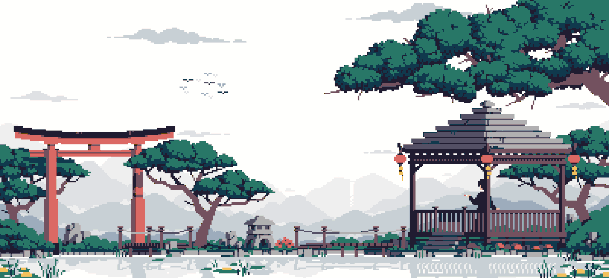
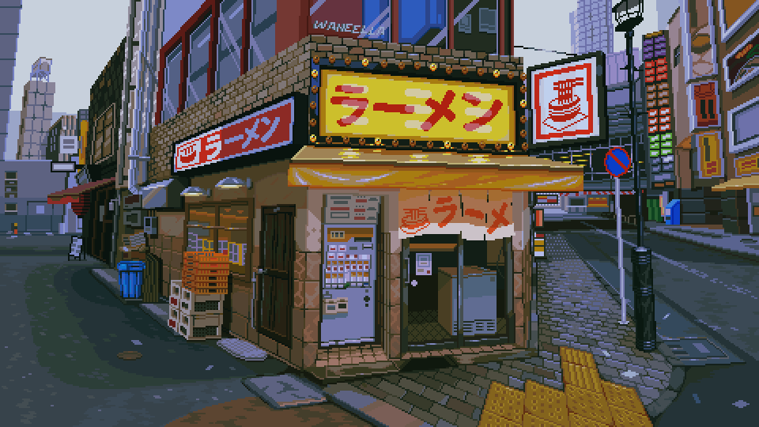

# Tamish Mhatre

**Artist · Writer · Learning to Build**

&nbsp;

---

### 🧑 About Me

I'm an artist and writer who started learning to code. I make stories, visuals, and now software.  
Most of my time goes into creating content — code is just the newest medium.

- 🎨 Artist and writer before anything else
- 🔧 Currently learning **Go** and **TypeScript**
- 🚀 Building tools that bring creative ideas to life
- 📸 I post my work on [Instagram](https://www.instagram.com/TAMISHMHATRE)

---

### 🔗 Connect

&nbsp;

---

### 📊 GitHub Stats

 

---

### 🛠️ Languages & Tools

---

### ⭐ Featured Projects

---

